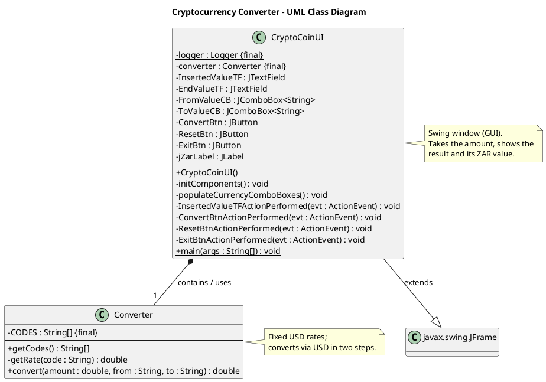

## Code 

```puml
@startuml
title Cryptocurrency Converter - UML Class Diagram
skinparam classAttributeIconSize 0
skinparam shadowing false

class "javax.swing.JFrame" as JFrame

class CryptoCoinUI {
  - {static} logger : Logger {final}
  - converter : Converter {final}
  - InsertedValueTF : JTextField
  - EndValueTF : JTextField
  - FromValueCB : JComboBox<String>
  - ToValueCB : JComboBox<String>
  - ConvertBtn : JButton
  - ResetBtn : JButton
  - ExitBtn : JButton
  - jZarLabel : JLabel
  --
  + CryptoCoinUI()
  - initComponents() : void
  - populateCurrencyComboBoxes() : void
  - InsertedValueTFActionPerformed(evt : ActionEvent) : void
  - ConvertBtnActionPerformed(evt : ActionEvent) : void
  - ResetBtnActionPerformed(evt : ActionEvent) : void
  - ExitBtnActionPerformed(evt : ActionEvent) : void
  + {static} main(args : String[]) : void
}

class Converter {
  - {static} CODES : String[] {final}
  --
  + getCodes() : String[]
  - getRate(code : String) : double
  + convert(amount : double, from : String, to : String) : double
}

CryptoCoinUI --|> JFrame : extends
CryptoCoinUI *-- "1" Converter : contains / uses

note right of CryptoCoinUI
  Swing window (GUI).
  Takes the amount, shows the
  result and its ZAR value.
end note

note right of Converter
  Fixed USD rates;
  converts via USD in two steps.
end note
@enduml

```

## How to Use

1. Go to [plantuml.com](https://plantuml.com/)
2. Paste code in the block 

	

3. Screenshot the code 

